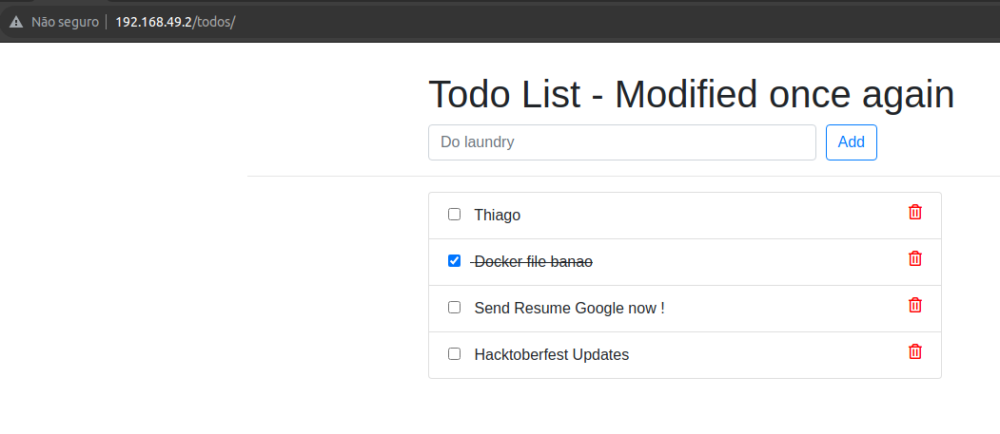

# django-todo
A simple todo app built with django


### Setup
To get this repository, run the following command inside your git enabled terminal
```bash
$ git clone https://github.com/shreys7/django-todo.git
```
You will need django to be installed in you computer to run this app. Head over to https://www.djangoproject.com/download/ for the download guide

Once you have downloaded django, go to the cloned repo directory and run the following command

```bash
$ python manage.py makemigrations
```

This will create all the migrations file (database migrations) required to run this App.

Now, to apply this migrations run the following command
```bash
$ python manage.py migrate
```

One last step and then our todo App will be live. We need to create an admin user to run this App. On the terminal, type the following command and provide username, password and email for the admin user
```bash
$ python manage.py createsuperuser
```

That was pretty simple, right? Now let's make the App live. We just need to start the server now and then we can start using our simple todo App. Start the server by following command

```bash
$ python manage.py runserver
```

Once the server is hosted, head over to http://127.0.0.1:8000/todos for the App.

Cheers and Happy Coding :)

<hr>

## Atividade Prática - Kubernetes

<p align="justify"> 
Faça o clone do repositório https://github.com/diegoep/django-todo. Essa é uma aplicação Python que roda um banco de dados Sqlite embarcado na aplicação. 

1. Faça a construção da imagem docker da aplicação (lembre de rodar "eval $(minikube docker-env") para usar o docker do ambiente do minikube
2. Crie os manifestos Kubernetes para implantar a aplicação django-todo e externalizar o acesso: Deployment, service, ingress
3. Pesquise e indique como seria possível manter estado em múltiplas execuções, visto que a aplicação armazena os dados em um sqlite rodando no próprio container.
</p>

## Resolução

<h3 align="justify">

APP:
- Deployment;
- Service (ClusterIP);
- Ingress

DB:
- PersistentVolume (PV);
- PersistentVolumeClaim (PVC);
- ConfigMap;
- Secret;
- Deployment;
- Service (ClusterIP)

</h3>

<br>

<p align="center">
    
</p>

<p align="justify">
A persistência de volume no Kubernetes permite armazenar dados de forma durável, mesmo que os pods sejam removidos ou recriados. Existem vários tipos de volumes que você pode usar, incluindo:

- EmptyDir: Um volume vazio que é criado quando um Pod é agendado em um nó e existe enquanto o Pod estiver sendo executado. No entanto, os dados são perdidos quando o Pod é removido.

- HostPath: Um volume que mapeia um diretório no nó do Kubernetes para o contêiner. É útil para acessar dados do sistema de arquivos do nó, mas não é adequado para ambientes de produção devido a limitações de segurança e escalabilidade.

- PersistentVolume (PV) e PersistentVolumeClaim (PVC): Permitem provisionar armazenamento persistente de forma independente do ciclo de vida dos Pods. Um PV representa um volume físico no cluster, enquanto um PVC é uma solicitação feita pelos usuários para um PV. O administrador do cluster configura PVs e os usuários solicitam PVs usando PVCs.
</p>